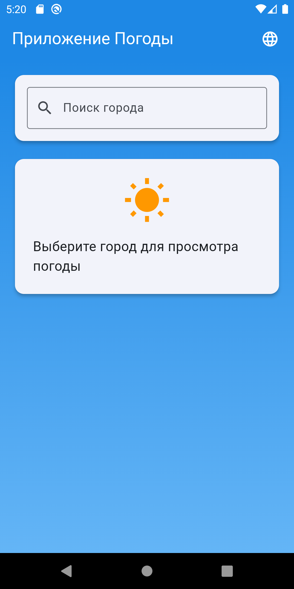
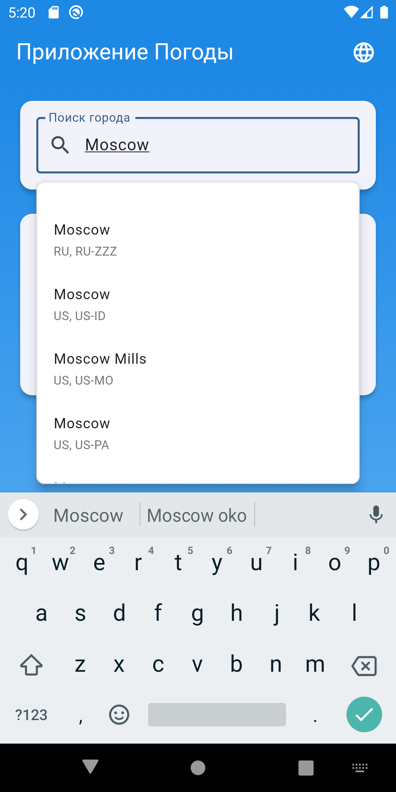
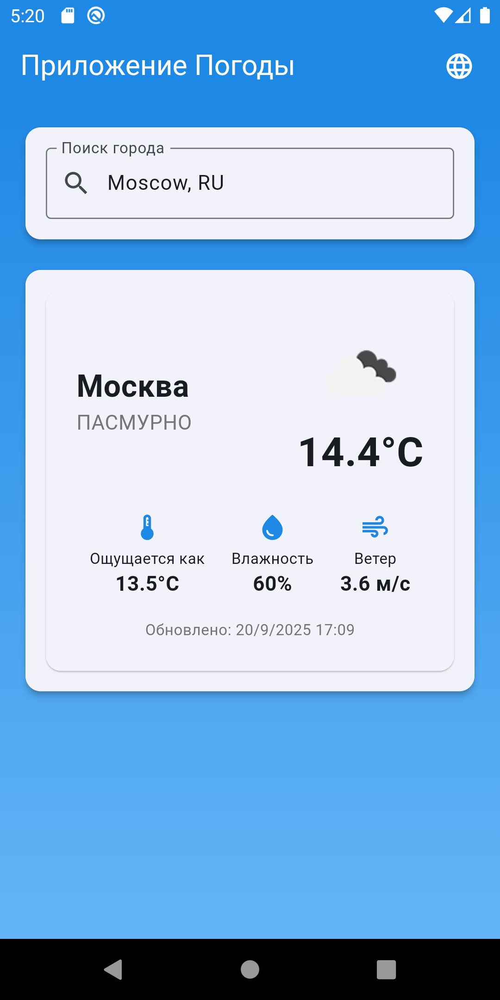

# 🌤️ Приложение Погоды

Flutter приложение для просмотра погоды в любом городе мира с поддержкой многоязычности.

## ✨ Особенности

- 🔍 **Поиск городов** - интеллектуальный поиск с автодополнением
- 🌡️ **Детальная погода** - температура, влажность, скорость ветра, ощущаемая температура
- 🌍 **Многоязычность** - поддержка русского и английского языков
- 💾 **Кеширование** - работа с кешированными данными
- 🔄 **Retry** - обработка сетевых ошибок
- ✅ **Валидация данных** - проверка входных данных на уровне домена
- 🏗️ **Clean Architecture** - архитектура для масштабируемости
## 📸 Скриншоты

<div align="center">
  
  
  
</div>

## 🏗️ Архитектура

Приложение построено с использованием **Clean Architecture** и следующих технологий:

### 🎯 Основные технологии
- **Flutter** - кроссплатформенная разработка
- **BLoC/Cubit** - управление состоянием
- **Dependency Injection** - внедрение зависимостей (GetIt + Injectable)
- **Repository Pattern** - абстракция доступа к данным
- **Use Cases** - инкапсуляция бизнес-логики
- **Either Pattern** - функциональная обработка ошибок

### 🔧 Дополнительные инструменты
- **Freezed** - генерация immutable классов
- **Easy Localization** - интернационализация
- **SharedPreferences** - локальное кеширование
- **Dio** - HTTP клиент с перехватчиками
- **Logger** - логирование


### 📁 Структура проекта

```
lib/
├── core/                           # Основная функциональность
│   ├── constants/                  # Константы API
│   ├── di/                        # Dependency Injection
│   │   ├── app_module.dart        # Централизованный модуль DI
│   │   ├── injection.dart         # Конфигурация DI
│   │   └── injection.config.dart  # Сгенерированный код
│   ├── errors/                    # Обработка ошибок
│   │   ├── exceptions.dart        # Исключения
│   │   ├── failures.dart          # Ошибки домена
│   │   └── error_handler.dart     # Глобальный обработчик ошибок
│   ├── localization/              # Локализация
│   │   └── app_localization.dart  # Статические строки
│   └── network/                   # Сетевой слой
│       ├── dio_client.dart        # HTTP клиент
│       └── retry_interceptor.dart # Перехватчик повторов
├── features/                      # Функциональные модули
│   └── weather_by_city_screen/    # Главный экран
│       └── weather_page.dart      # Страница погоды
├── shared/                        # Общие компоненты
│   └── components/
│       ├── cities/                # Модуль поиска городов
│       │   ├── data/              # Слой данных
│       │   │   ├── api/           # API клиенты
│       │   │   ├── datasources/   # Источники данных (Remote + Local)
│       │   │   ├── models/        # Модели данных
│       │   │   ├── mappers/       # Мапперы
│       │   │   └── repositories/  # Репозитории
│       │   ├── domain/            # Бизнес-логика
│       │   │   ├── entities/      # Сущности
│       │   │   ├── repositories/  # Интерфейсы репозиториев
│       │   │   └── usecases/      # Use Cases
│       │   └── presentation/      # UI слой
│       │       ├── bloc/          # BLoC/Cubit
│       │       └── widgets/       # Виджеты
│       └── weather/               # Модуль погоды
│           └── [аналогичная структура]
├── main.dart                      # Точка входа
└── assets/                        # Ресурсы
    └── translations/              # Файлы локализации
        ├── ru.json               # Русский язык
        └── en.json               # Английский язык
```

## 🚀 Быстрый старт

### Предварительные требования

- Flutter SDK (>=3.0.0)
- Dart SDK (>=3.0.0)
- Android Studio / VS Code
- Git

### Установка

1. **Клонируйте репозиторий**
   ```bash
   git clone https://github.com/FroseMan97/flutter_weather_app.git
   cd flutter_weather_app
   ```

2. **Установите зависимости**
   ```bash
   flutter pub get
   ```

3. **Сгенерируйте код**
   ```bash
   dart run build_runner build --delete-conflicting-outputs
   ```

4. **Запустите приложение с API ключами**
   ```bash
   # Android
   flutter run --dart-define=WEATHER_API_KEY=your_openweather_key --dart-define=AMADEUS_API_KEY=your_amadeus_key --dart-define=AMADEUS_API_SECRET=your_amadeus_secret
   
   # iOS
   flutter run --dart-define=WEATHER_API_KEY=your_openweather_key --dart-define=AMADEUS_API_KEY=your_amadeus_key --dart-define=AMADEUS_API_SECRET=your_amadeus_secret
   
   # Web
   flutter run -d chrome --dart-define=WEATHER_API_KEY=your_openweather_key --dart-define=AMADEUS_API_KEY=your_amadeus_key --dart-define=AMADEUS_API_SECRET=your_amadeus_secret
   ```

## 🔧 Настройка

### API Ключи

Приложение использует два внешних API:

1. **OpenWeatherMap** - для получения данных о погоде
   - Зарегистрируйтесь на [OpenWeatherMap](https://openweathermap.org/api)
   - Получите бесплатный API ключ
   - Передайте ключ как параметр `WEATHER_API_KEY` при запуске

2. **Amadeus** - для поиска городов
   - Зарегистрируйтесь на [Amadeus for Developers](https://developers.amadeus.com/)
   - Создайте приложение и получите API ключ и секрет
   - Передайте их как параметры `AMADEUS_API_KEY` и `AMADEUS_API_SECRET` при запуске

### Получение API ключей

**OpenWeatherMap:**
1. Перейдите на [OpenWeatherMap](https://openweathermap.org/api)
2. Нажмите "Sign Up" и создайте аккаунт
3. Подтвердите email
4. Войдите в аккаунт и перейдите в "API keys"
5. Скопируйте "Default" ключ

**Amadeus:**
1. Перейдите на [Amadeus for Developers](https://developers.amadeus.com/)
2. Нажмите "Get Started" и создайте аккаунт
3. Войдите в "My Self-Service Workspace"
4. Нажмите "Create New App" и выберите "Self-Service" план
5. В разделе "API Keys & Secret" скопируйте ключи

### Локализация

Приложение поддерживает русский и английский языки. Файлы переводов находятся в `assets/translations/`:

- `ru.json` - русский язык
- `en.json` - английский язык

Для добавления нового языка:
1. Создайте файл `assets/translations/{код_языка}.json`
2. Добавьте переводы всех строк
3. Обновите `supportedLocales` в `main.dart`

## 📱 Использование

1. **Поиск города**
   - Введите название города в поле поиска, например, Moscow
   - Выберите город из списка предложений

2. **Просмотр погоды**
   - После выбора города отобразится текущая погода
   - Информация включает температуру, влажность, скорость ветра

## 🧪 Тестирование


### 🚀 Запуск тестов
```bash
# Все тесты
flutter test

# Тесты Use Cases
flutter test test/features/cities/domain/usecases/
flutter test test/features/weather/domain/usecases/

# Тесты репозиториев
flutter test test/features/cities/data/repositories/
flutter test test/features/weather/data/repositories/

# Тесты BLoC/Cubit
flutter test test/features/cities/presentation/bloc/
flutter test test/features/weather/presentation/bloc/
```

## 📦 Зависимости

### 🎯 Основные пакеты
```yaml
dependencies:
  flutter_bloc: ^8.1.6          # Управление состоянием
  dio: ^5.7.0                   # HTTP клиент
  get_it: ^8.0.0                # Service Locator
  injectable: ^2.4.4            # DI код генерация
  easy_localization: ^3.0.7     # Интернационализация
  dartz: ^0.10.1                # Функциональное программирование
  shared_preferences: ^2.2.2    # Локальное хранение
  logger: ^2.0.2+1              # Логирование
  freezed_annotation: ^2.4.4    # Immutable классы
  json_annotation: ^4.9.0       # JSON сериализация
```

### 🔧 Dev зависимости
```yaml
dev_dependencies:
  build_runner: ^2.4.7          # Код генерация
  freezed: ^2.4.6               # Генерация immutable классов
  json_serializable: ^6.7.1     # JSON сериализация
  injectable_generator: ^2.4.1  # DI генерация
  mockito: ^5.4.5               # Моки для тестов
  bloc_test: ^9.1.7             # Тестирование BLoC
  flutter_test:                 # Тестирование
    sdk: flutter
```
